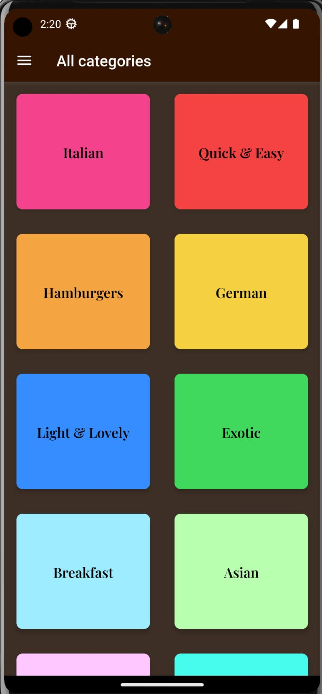
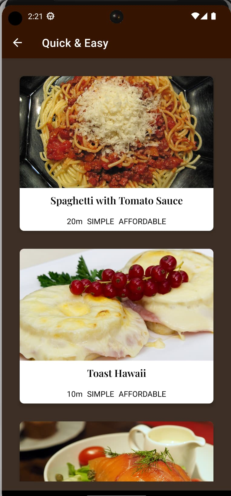
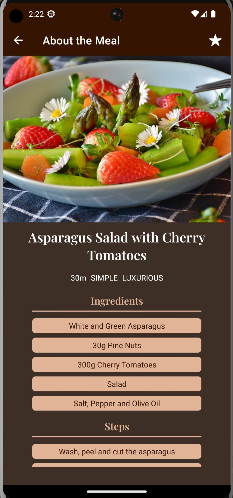
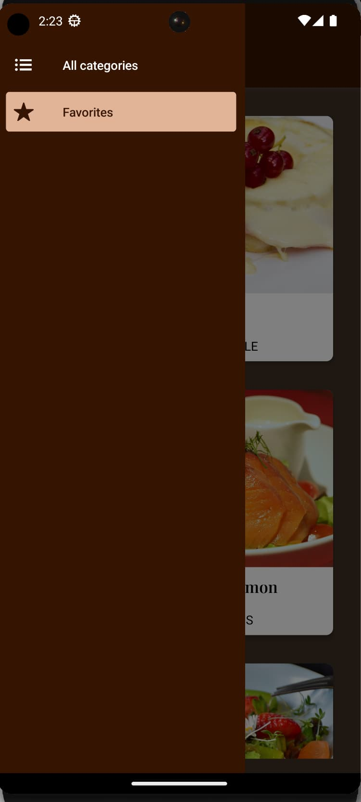

# FoodApp 🍲📱

FoodApp is a mobile application built with React Native, offering a simple and intuitive interface to explore and save your favorite dishes from various cuisines.

## About The App 📚

Upon launching the application, the first screen you will encounter is "All Categories". Here, you can browse through various dish categories such as Italian, Asian, Exotic, Hamburgers, and more. By clicking on a category, you will be navigated to a tab displaying dishes corresponding to the chosen category.

For every dish, there is an "About the Meal" screen providing detailed information about the dish, including an image, ingredients, and preparation steps. If a dish captures your interest, you can add it to your favorites by clicking the star icon. You can navigate back to the categories screen or proceed to your favorites screen at any point using the Drawer Navigator.

As of now, FoodApp is in its development phase and hasn't been deployed yet, but plans for deployment are in the pipeline.

## Screenshots 📸

  
  
  
  

## Tech Stack and Libraries 💻

FoodApp is built leveraging React Native. Other key technologies and libraries used include:

- React Navigation (Drawer and Native Stack) for effective screen management and navigation.
- Redux and Redux Toolkit for efficient state management.
- Expo for a universal runtime and libraries to construct iOS, Android, and web applications.

## Author 🧑‍💻

FoodApp is diligently developed and maintained by Denys Kyzym (me).

Stay tuned for future updates and deployment news! 🚀🔥
